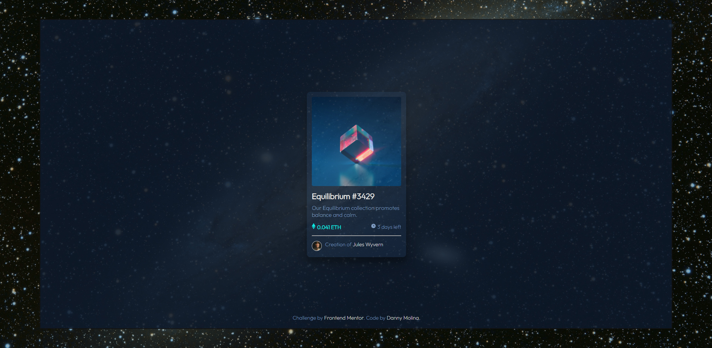

# Frontend Mentor - NFT preview card component

## Welcome! 👋

# Frontend Mentor: NFT preview card component solution

This is a solution to [Frontend Mentor NFT Preview Card Component Challenge] (https://www.frontendmentor.io/challenges/nft-preview-card-component-SbdUL_w0U).

##Table of Contents

- [Resume](#resume)
  - [The challenge](#the-challenge)
  - [Screenshot](#screenshot)
  - [Links](#links)
- [My process](#my-process)
  - [built with](#built with)
  - [What I learned](#what-I-learned)
  - [Continuous development](#continuous-development)
  - [Useful resources](#useful-resources)
- [Author](#author)
- [Thanks](#thanks)

## General description

### Links

- Solution URL: [https://github.com/DannyMolina/nft-preview-card]
- Live Site URL: [https://nftpreviewcardpsyduck.netlify.app/]

### Built with

- Semantic HTML5 markup
- CSS custom properties
- flexible box
- CSS Grid
- Mobile first workflow

### What I learned

The project was made easier for me with my knowledge that although they are not very extensive I was able to solve the challenge, but my main problem lies in placing the blue element with its icon on the image of the NFT It was something that was difficult for me but I managed to solve it 2 days later

### Continuous development

I would like to focus on learning the effects with CSS, it is something that is difficult for me and I must polish

### Useful Resources

Do not use

## Author

- Website - [https://github.com/DannyMolina] (
- Frontend Mentor - [@DannyMolina]
- Twitter - [@Customdraw]

## Thanks

I thank the universe for giving me the patience to continue programming that it is not easy to always face the process of solving problems with the skills you have, THANK YOU.